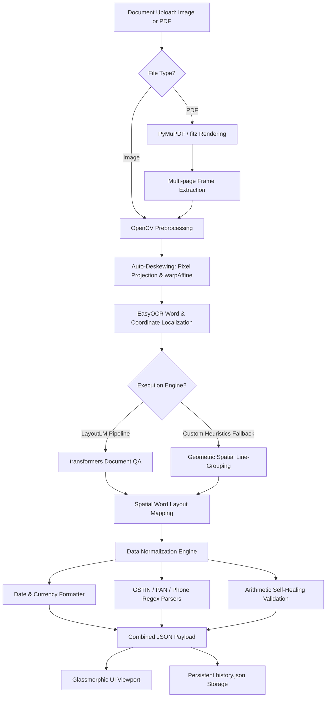

# Xtract: Multi-Modal Document Intelligence & OCR Extraction Sandbox

[](https://www.python.org/)
[](https://fastapi.tiangolo.com/)
[](https://pytorch.org/)
[](https://huggingface.co/)
[](https://opencv.org/)
[](LICENSE)

**Xtract** is an enterprise-grade, high-aesthetic interactive document intelligence sandbox designed to benchmark, visualize, and execute state-of-the-art key information extraction (KIE) and optical character recognition (OCR) models. 

By integrating a robust **FastAPI** backend with a modern glassmorphic web dashboard, Xtract enables users to upload invoice/receipt images or multi-page PDFs, visualize spatial bounding boxes, interactively map document content to structured schema values, and simulate machine learning model training loops with live metric plots.

---

## ⚙️ System Pipeline Architecture

The following diagram illustrates how a document flows through the Xtract processing pipelines, from ingestion to key-value serialization:



---

## 🚀 Key Features

### 1. Multi-Model OCR & Extraction Sandbox
Compare lightweight, line-level recurrent architectures with advanced multimodal transformers:
* **Custom CRNN (CNN + BLSTM + CTC)**: A PyTorch convolutional recurrent network with Connectionist Temporal Classification (CTC) greedy decoding designed for fast line-level text recognition (~12ms latency).
* **TrOCR (ViT + GPT-2)**: An end-to-end vision-text transformer (ViT Image Processor + GPT-2 Decoder) developed by Microsoft, exceptional for transcribing handwritten, distorted, or heavily rotated text crops (~115ms latency).
* **LayoutLM (v1/v2/v3)**: A multimodal transformer that merges visual page layouts, 2D coordinates (bounding boxes), and text token embeddings. Integrated via Hugging Face's Document Question-Answering pipeline to extract semantic tags.
* **Offline Fallback Engine**: A pure geometry-based template matching script that guarantees continuous operations even without GPU access or Hugging Face server connections.

### 2. Auto-Deskewing (Orientation Correction)
* Uses OpenCV to detect text layout skew angles in uploaded documents.
* Thresholds images via Otsu's binarization, finds coordinate masks of text blobs, calculates the minimum bounding rectangle angle, and applies a `warpAffine` horizontal rotation (between 0.5 and 45 degrees) before running OCR. This prevents slanted lines from corrupting line-grouping algorithms.

### 3. Intelligent Table & Metadata Parsing
* **Line Items Table Extraction**: Groups raw OCR bounding boxes into horizontal text rows by checking vertical boundary overlaps. It scans each row from right to left to locate column prices, aligns item descriptions, separates quantities and unit prices, and filters out boilerplate text.
* **Indian GSTIN & PAN Parsers**: Extracts and normalizes government tax IDs (GSTIN/PAN), correcting common OCR digit-substitution errors (e.g., normalizing `O` to `0` or `I` to `1` in state codes).
* **Multilingual Synonym Mapping**: Parses labels across **English, Spanish, French, and German** (e.g., matching *Subtotal* with *base imponible*, *netto*, *total net*; *Tax* with *IVA*, *tva*, *mwst*, *steuern*).

### 4. Arithmetic self-healing Validation
* Inspects whether extracted fields satisfy the equation:  
  $$\text{Subtotal} + \text{Tax} = \text{Total}$$
* If a mathematical mismatch occurs (usually due to OCR character noise or dollar-to-digit misreads), the engine triggers an **inference auto-correction script**:
  1. It generates candidate values using a **digit-stripping generator** (cleaning bracket noise, European comma decimals, and isolated OCR prefix artifacts like `0],C0 -> 0.00`).
  2. It evaluates combination costs to identify the closest mathematically consistent values.
  3. If a value is missing (marked as `"Not Found"`), it mathematically infers the missing parameter.
* Outputs validation status alerts to the frontend interface in real-time.

### 5. Fine-Tuning Playground Simulator
* Fine-tune LayoutLM, TrOCR, or CRNN models on standard benchmarks (**FUNSD** for form understanding or **CORD** for receipt extraction).
* Adjust hyperparameters dynamically: target epochs (1 to 50), learning rates, and batch sizes.
* Visualizes real-time terminal output, loss curves, precision, recall, and F1 progress on an interactive Chart.js line plot.

### 6. Interactive Canvas & Extraction History
* **Bounding Box Mapping**: Hovering or clicking bounding boxes on the document overlay links coordinates directly to input fields and sidebar information cards.
* **Persistent Session Logging**: Saves past uploads, latency metrics, and structured extraction fields in a local JSON database, with a one-click cache purge button to clean disk uploads.

---

## 📁 Project Directory Structure

The repository is structured as follows:

```bash
ocr_document_extraction/
├── app.py                  # FastAPI web server, routing endpoints, and PDF page splitter
├── ocr_pipeline.py         # OpenCV deskewing, EasyOCR, TrOCR wrappers, and spatial table parser
├── training_pipeline.py    # PyTorch training loops & LayoutLM FUNSD/CORD dataset loaders
├── generate_samples.py     # Script to generate sample invoice/receipt layouts using Pillow
├── requirements.txt        # Python backend package dependencies
├── uploads/                # Directory for uploaded documents and history.json database
├── samples/                # Default sample images for testing the sandbox
└── static/                 # Front-end dashboard assets
    ├── index.html          # Glassmorphic HTML5 UI template
    ├── styles.css          # Styling system (glassmorphic layout, dark mode, animation states)
    └── app.js              # Canvas overlay coordinate mapping, Chart.js logic, and API calls
```

---

## 🛠️ Setup & Installation

### 1. Prerequisites
Ensure you have **Python 3.8+** installed. A GPU with CUDA compatibility is recommended but not required.

### 2. Configure Virtual Environment
Initialize a clean Python virtual environment to manage dependencies:

```bash
# Create the virtual environment
python -m venv .venv

# Activate the virtual environment
# Windows (PowerShell):
.venv\Scripts\Activate.ps1
# Windows (CMD):
.venv\Scripts\activate.bat
# Linux/macOS (Bash):
source .venv/bin/activate
```

### 3. Install Dependencies
Install packages listed in `requirements.txt`. Note that **PyMuPDF** (`pymupdf`) is required for rendering multi-page PDFs:

```bash
pip install -r requirements.txt
pip install pymupdf
```

> [!NOTE]
> On the first run of LayoutLM or TrOCR models, the application will automatically connect to Hugging Face Hub and download the required weights (`impira/layoutlm-document-qa` and `microsoft/trocr-base-handwritten`). This might take a few minutes depending on your internet connection.

---

## 🖥️ Running the Application

### 1. Generate Sandbox Testing Samples
To generate sample invoices and receipts for immediate testing without importing external documents, execute:

```bash
python generate_samples.py
```
This writes `receipt_sample_1.jpg` and `invoice_sample_2.jpg` to the `samples/` directory.

### 2. Start the FastAPI Server
Launch the server using Uvicorn:

```bash
python -m uvicorn app:app --reload
```

The terminal will confirm the server is running. Navigate to the web app:
👉 **[http://127.0.0.1:8000](http://127.0.0.1:8000)**

---

## 📡 API Endpoints Reference

### 1. Upload Document
* **Endpoint**: `POST /api/upload`
* **Content-Type**: `multipart/form-data`
* **Form Parameters**:
  * `file`: Binary file upload (supported formats: `.jpg`, `.jpeg`, `.png`, `.webp`, `.pdf`).
  * `use_layoutlm`: `boolean` (default: `true`)
  * `use_trocr`: `boolean` (default: `true`)
  * `use_crnn`: `boolean` (default: `false`)
* **Response Output**:
  ```json
  {
    "document_type": "invoice",
    "fields": {
      "merchant": { "value": "Apex Tech Solutions Ltd.", "bbox": [50, 45, 450, 85] },
      "date": { "value": "2026-05-28", "bbox": [550, 120, 750, 140] },
      "invoice_no": { "value": "TX-90214", "bbox": [550, 90, 750, 110] },
      "items": [
        {
          "serial": "",
          "name": "Cloud Infrastructure Setup",
          "quantity": "1",
          "rate": "$1,200.00",
          "price": "$1,200.00",
          "bbox": [50, 320, 750, 345]
        }
      ],
      "subtotal": { "value": "$3,300.00", "bbox": [500, 520, 750, 540] },
      "tax": { "value": "$264.00", "bbox": [500, 550, 750, 570] },
      "total": { "value": "$3,564.00", "bbox": [480, 580, 750, 630] }
    },
    "bounding_boxes": [...],
    "raw_ocr_words": [...],
    "file_url": "/uploads/example_uuid.jpg",
    "processing_time_sec": 0.82
  }
  ```

### 2. Fine-Tuning Simulator
* **Endpoint**: `POST /api/train-simulate`
* **Payload JSON**:
  ```json
  {
    "dataset": "funsd",
    "model_type": "layoutlm",
    "epochs": 15,
    "learning_rate": 0.0005,
    "batch_size": 8
  }
  ```
* **Response**: Epoch-by-epoch training statistics including loss reduction curves and metrics progression.

### 3. Check Models Status
* **Endpoint**: `GET /api/models`
* **Description**: Verifies if CPU or GPU acceleration (CUDA) is activated and returns weight size data and initialization status for CRNN, TrOCR, and LayoutLM.

### 4. Clear Extraction History
* **Endpoint**: `POST /api/history/clear`
* **Description**: Clears `history.json` logs and safely deletes uploaded files from the disk, retaining default testing samples.

---

## 🧠 Model Specifications & Reference Metrics

The table below summarizes benchmarks for each model incorporated into Xtract:

| Model ID | Neural Architecture | Default Task | Avg. Latency | Weights Size | Benchmark F1 |
| :--- | :--- | :--- | :--- | :--- | :--- |
| **CRNN** | ResNet CNN + Bi-LSTM + CTC | Character sequence transcription | ~12ms | ~45 MB | 0.86 (ICDAR) |
| **TrOCR** | ViT Encoder + GPT-2 Decoder | Visual crop transcriptions | ~115ms | ~420 MB | 0.94 (SROIE) |
| **LayoutLM** | Text + 2D Spatial Layout + Visuals | Key Information Extraction (KIE) | ~340ms | ~610 MB | 0.91 (FUNSD) |

---

## 📄 License
This project is licensed under the MIT License. Details can be found in the [LICENSE](LICENSE) file.
